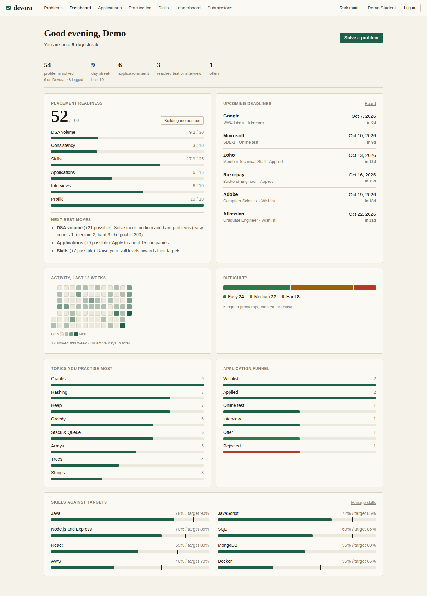
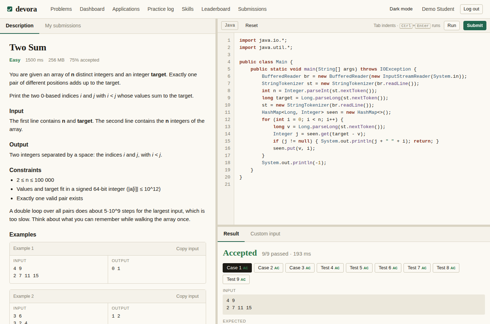
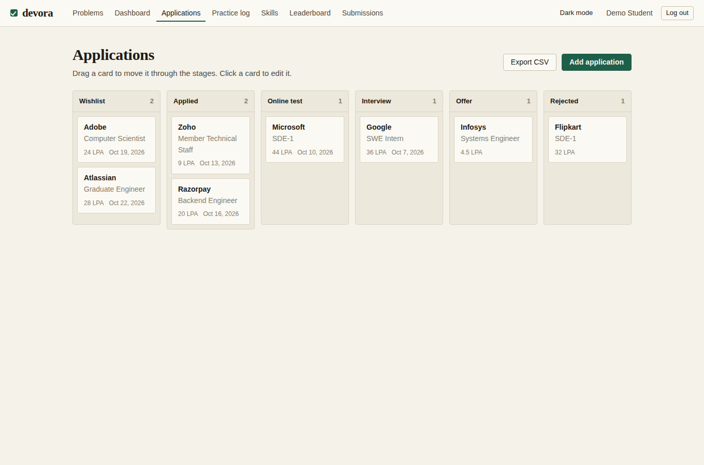
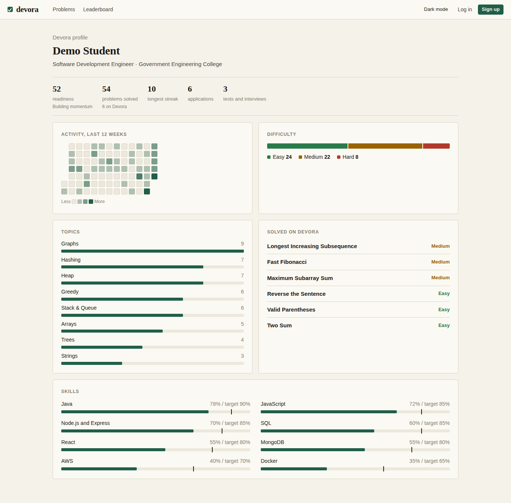

# Devora

**Practice, judge and placement tracking in one app.** Devora is an online judge for Java (write code in the browser,
get a verdict) combined with a placement command centre: application board, practice log, skills roadmap, a transparent
readiness score and a shareable public profile for recruiters.

**Stack:** Node.js 22 · Express · SQLite (built into Node, nothing to compile) · vanilla JS single-page UI with a
hand-written code editor and CSS-only charts · Docker sandbox for untrusted code · GitHub Actions CI

| Dashboard | Judge |
|---|---|
|  |  |
| **Application board** | **Public profile** |
|  |  |

## What it does

**Online judge**
* 8 starter problems (Easy to Hard) with large hidden tests, so slow solutions really do get Time Limit Exceeded.
* Editor with syntax highlighting, auto-indent and resizable panes. **Run** tries the examples or your own input; **Submit**
  judges every hidden test.
* Verdicts: Accepted, Wrong Answer, Time Limit, Memory Limit, Output Limit, Runtime Error, Compile Error.
* Submission history with code, leaderboard, user profiles, and an admin screen to add problems and tests (large test
  files can be uploaded).

**Placement tools**
* **Dashboard:** readiness score with breakdown and "next best moves", streak, 12-week activity heatmap, difficulty split,
  topics, application funnel, upcoming deadlines, skills against targets.
* **Applications:** drag-and-drop board (Wishlist, Applied, Online test, Interview, Offer, Rejected) with package, deadline,
  notes and an automatic status history.
* **Practice log:** problems solved on LeetCode, Codeforces and similar sites. They count towards your streak and score
  together with what you solve on Devora.
* **Skills roadmap:** current level against target level per skill.
* **Public profile** (opt-in, `/#/p/<username>`): counts, activity and skills only. Never company names, notes or email.
* **CSV export** of applications and practice log (with spreadsheet formula-injection protection).
* **Accounts:** email or username login, scrypt password hashing, signed HttpOnly cookies, rate limiting, optional
  "Continue with Google".

